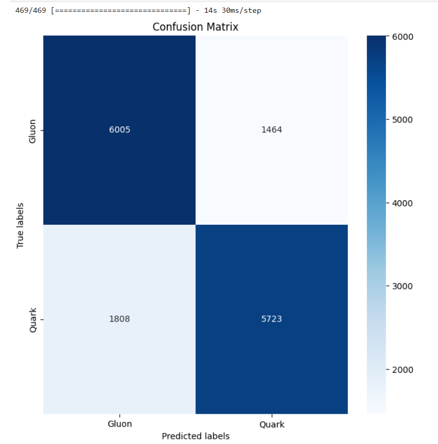

## Comparison Analysis of the 2 models Architecture
### ParticleNet Lite
#### Dynamic Graph Convolutional Neural Network

Link of paper: https://arxiv.org/abs/1902.08570

**100 Epochs**

469/469 [==============================] - 9s 19ms/step - loss: 0.5138 - accuracy: 0.7533 - auc: 0.8271

**Evaluation Metric of model on test data**
- Loss: 0.513751745223999
- Accuracy: 0.753333330154419
- AUC: 0.8270620703697205

#### Modified ParticleNet Lite
#### Additional CNN layers
Additionally processing spatial information and channel-wise information using convolutional layers, batch normalisation and max pooling

**30 Epochs**

469/469 [==============================] - 8s 17ms/step - loss: 0.5077 - accuracy: 0.7819 - auc: 0.8568

**Evaluation Metric of model on test data**
- Loss: 0.5076521635055542
- Accuracy: 0.7818666696548462
- AUC: 0.8568345308303833

Model 2 is giving better results with lesser epochs